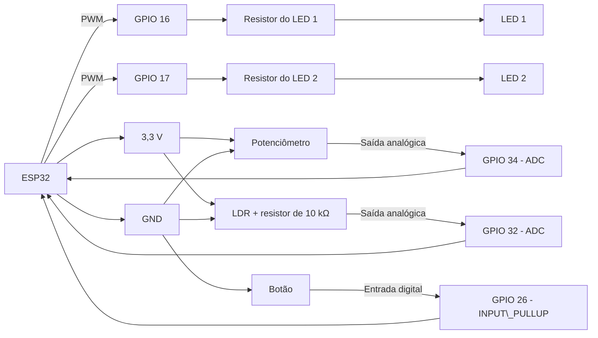
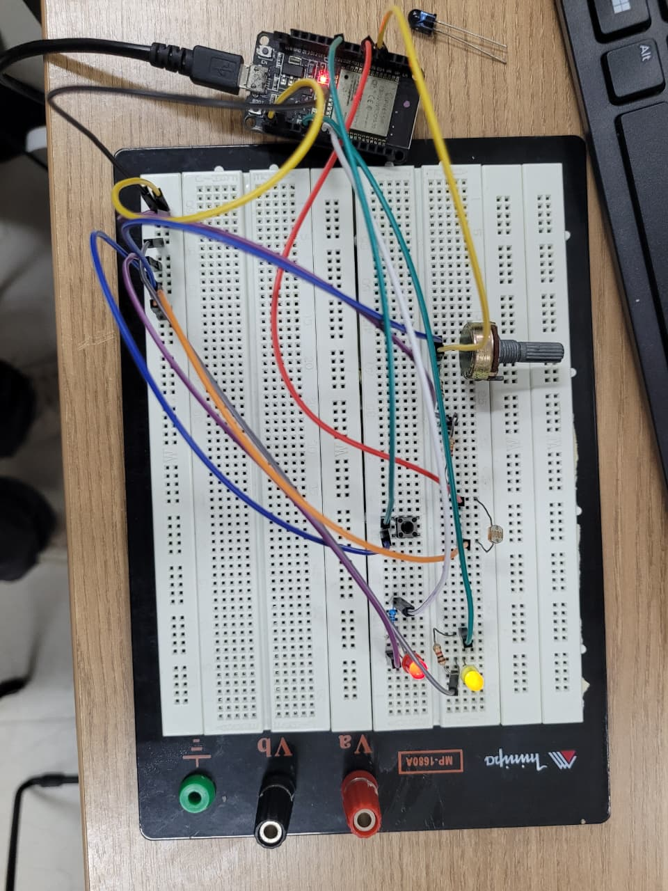
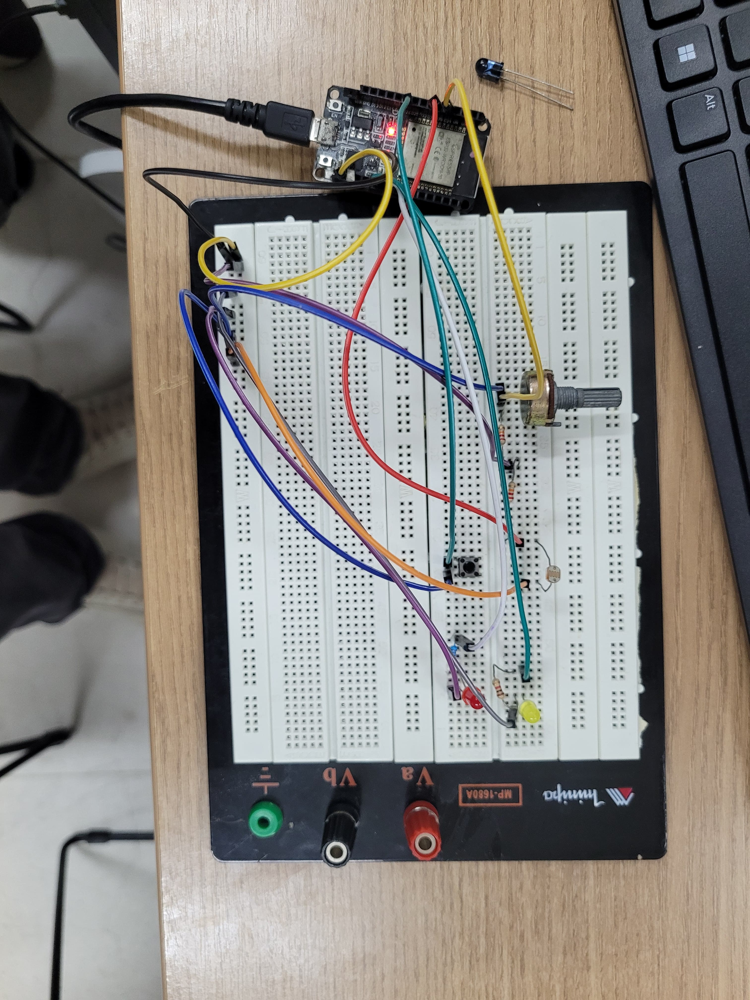

# Introdução

Este projeto apresenta o desenvolvimento de uma aplicação embarcada utilizando um microcontrolador ESP32, com o objetivo de aplicar conceitos fundamentais de programação e montagem de circuitos para Internet das Coisas. A aplicação utiliza um potenciômetro, um sensor LDR e um botão como entradas, além de dois LEDs como elementos de saída.

O sistema possui dois modos de funcionamento: manual e automático. No modo manual, selecionado inicialmente pelo microcontrolador, o valor de um potenciômetro é obtido por meio do conversor analógico-digital (ADC). Já no modo automático, o valor utilizado é proveniente de um LDR, permitindo que o comportamento do circuito seja influenciado pela intensidade luminosa do ambiente. A alternância entre os modos é realizada por meio de um botão.

Os valores obtidos pelas entradas analógicas são utilizados para controlar o funcionamento dos LEDs. O primeiro LED tem sua intensidade luminosa ajustada por modulação por largura de pulso (PWM), enquanto o segundo LED pisca em intervalos que variam entre 100 ms e 1000 ms, de acordo com o valor lido pelo ADC. Para isso, é necessário realizar a conversão dos valores obtidos pelo microcontrolador para as faixas adequadas de operação das saídas.

## Diagrama de montagem

A montagem utiliza um ESP32, um potenciômetro, um LDR, um botão e dois LEDs. As entradas analógicas são conectadas aos pinos GPIO 34 e GPIO 32, enquanto os LEDs são controlados pelos pinos GPIO 16 e GPIO 17.

> **Observação:** diagrama gerado por I.A

## Modo manual

Potenciômetro no máximo, LED no brilho máximo!

## Modo automático

Muita luz, LED no brilho mínimo!

> **Observação:** o código executado na montagem foi ligeiramente diferente do código presente neste repositório. Na versão utilizada na montagem, considerava-se que, quanto maior a luminosidade do ambiente, menor deveria ser o brilho do LED. Já na versão “corrigida” disponível neste repositório, esse comportamento foi invertido: quanto maior a luminosidade do ambiente, maior será o brilho do LED.
